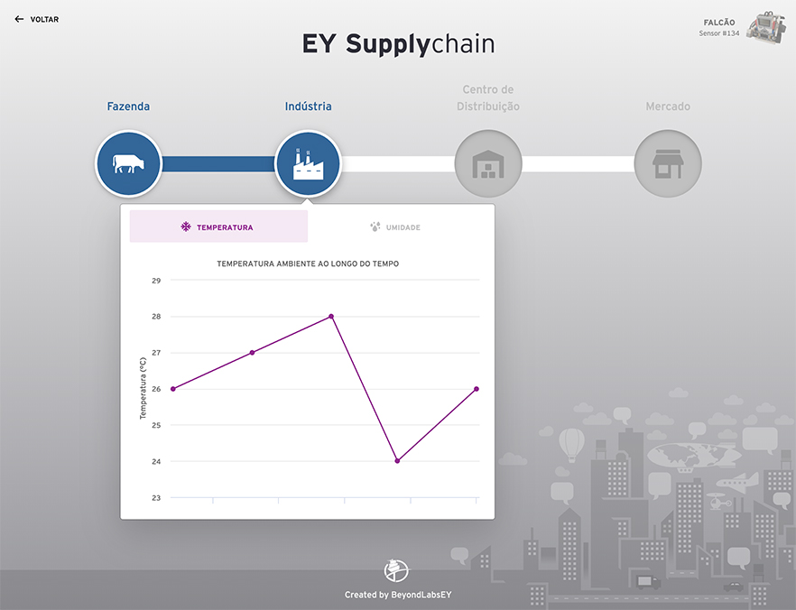

# EY Supply Chain

<p>
  
</p>

Esta aplicação consiste em exibir dados coletados e armazenados em Blockchain a por meio de sensores de temperatura e umidade.

## Funcionamento

São exibidos os passos/locais de uma cadeia de produção.

Para cada local, podem ser exibidas medições de temperatura ambiente e umidade relativa do ar.

Ao clicar no local desejado, um popover é exibido contendo duas abas (temperatura e umidade). Selecionando uma das abas, pode-se visualizar o gráfico correspondente. Os dados contidos no gráfico marcam os valores ao decorrer do intervalo de tempo entre as últimas cinco medições.

## Executando localmente

Este repositório contém toda a estrutura da camada de front-end (que é executada no client) e foi gerada através do [Node Package Manager](https://docs.npmjs.com/downloading-and-installing-node-js-and-npm).

Para executar em ambiente local, siga as instruções a seguir.

### Instalando os pacotes

Após fazer o download do repositório, todas as dependências do Node devem ser instaladas localmente via NPM.

Para instalar, executar o comando ```npm install``` na pasta raiz do projeto.

### Ambiente de desenvolvimento

Para visualizar a aplicação em modo desenvolvimento, executar a task ```npm run dev``` na raiz do projeto.

### Build em produção

Executar a task ```npm run build``` na raiz do projeto para gerar o build.

Feito isso, será criada uma pasta ```dist``` contendo todo o código necessário para deploy em produção.